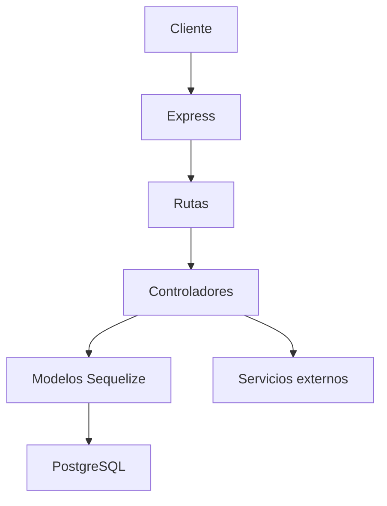
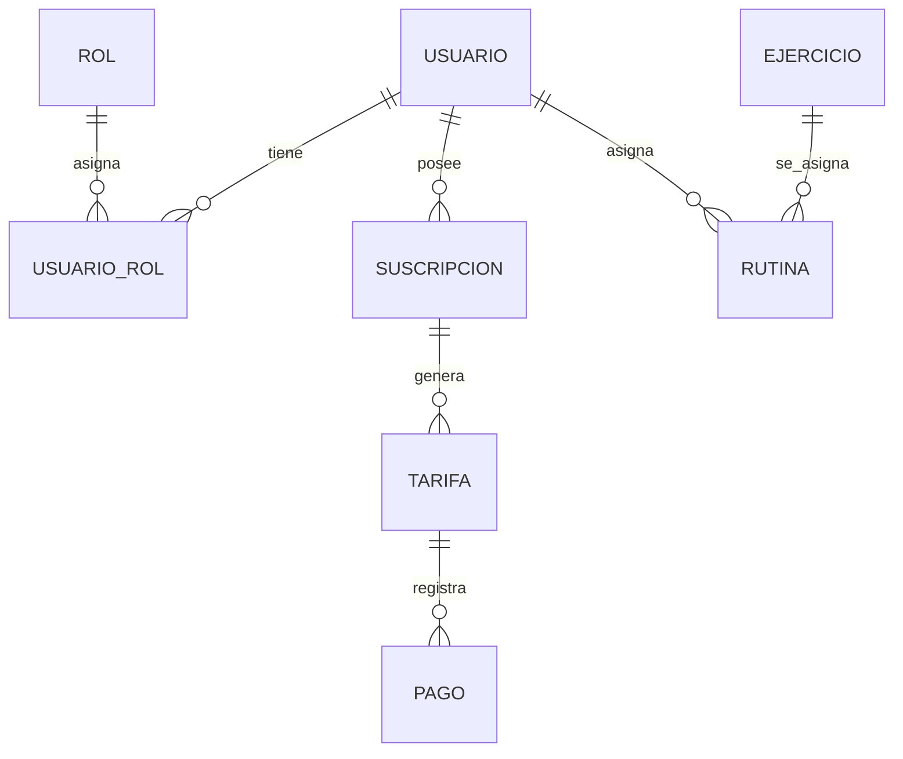
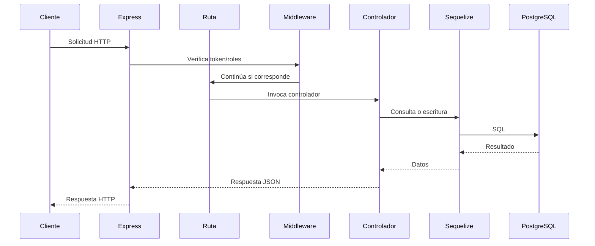

# GymHub Backend

## Introducción

Este proyecto corresponde al backend de una aplicación para la gestión de un gimnasio. El sistema fue desarrollado como trabajo final de la materia Programación y Servicios Web y tiene como propósito central administrar usuarios, roles, ejercicios, rutinas, suscripciones, cuotas, pagos y métricas básicas del negocio mediante una API REST construida con Node.js y Express. La solución no se limita a exponer operaciones CRUD; además incorpora autenticación con JWT, autorización por roles, autenticación con Google, integración con MercadoPago, envío de correos transaccionales y documentación automática con Swagger. El backend fue pensado para servir como capa de negocio y acceso a datos de una aplicación más amplia, en la que el frontend consume los endpoints expuestos por este servicio.

La problemática que aborda el proyecto es la necesidad de digitalizar procesos de gestión que, en un gimnasio, suelen resolverse de forma manual o dispersa: registro de socios, asignación de permisos, administración de rutinas, control de cuotas y seguimiento de pagos. Desde la perspectiva del backend, el problema no consiste únicamente en almacenar información, sino en hacerlo de forma ordenada, segura y escalable. Por ello, el sistema implementa una estructura modular con separación entre rutas, controladores, modelos y servicios, además de un mecanismo de autenticación y autorización que permite diferenciar el acceso de administradores, entrenadores y socios.

El alcance del proyecto incluye la creación de una API REST funcional, conectada a PostgreSQL a través de Sequelize, con soporte para operaciones sobre usuarios, roles, ejercicios, rutinas, suscripciones, tarifas, pagos y estadísticas. Se incorporaron funcionalidades de integración externa como el uso de MercadoPago para la generación de links de pago, Google OAuth para el login, Resend para emails de bienvenida y Swagger para documentar la API. El proyecto, en su estado actual, está orientado a un entorno de desarrollo local y a una integración con un frontend que consume los servicios expuestos en los distintos endpoints.

Las tecnologías elegidas responden a una combinación de simplicidad, madurez y compatibilidad con la arquitectura propuesta. Node.js aporta un entorno de ejecución rápido para construir APIs en JavaScript; Express proporciona un framework mínimo pero potente para definir rutas y middleware; Sequelize actúa como ORM para abstraer la interacción con PostgreSQL; dotenv permite trabajar con variables de entorno sin hardcodear datos sensibles; CORS define el acceso desde el origen del frontend; Swagger permite generar documentación desde el propio código; y bcrypt, jsonwebtoken, google-auth-library y axios cubren necesidades de seguridad, autenticación, integración externa y comunicación HTTP. La elección de PostgreSQL como motor relacional responde a la estructura de datos del sistema, que requiere relaciones entre usuarios, roles, rutinas, cuotas y pagos con consistencia transaccional.

La arquitectura del backend es de tipo modular por capas, con una organización clara en torno a la responsabilidad de cada componente. La capa de entrada está formada por Express y las rutas; la capa de aplicación por los controladores; la capa de persistencia por los modelos definidos con Sequelize; y la capa de infraestructura por la conexión a PostgreSQL, variables de entorno y servicios de integración. Esta estructura facilita la comprensión del código, permite extender la API con nuevos módulos y redunda la complejidad del proyecto en piezas más pequeñas y manejables. En términos generales, el backend funciona como un servicio orientado a recursos, donde cada módulo expone operaciones CRUD y, en algunos casos, lógica adicional para la validación de reglas de negocio.

## Plan de Trabajo

El desarrollo del proyecto se organizó en etapas explícitas, que pueden reconstruirse a partir del historial de Git y de la evolución del código. La primera etapa corresponde a la configuración inicial del backend: instalación de dependencias, creación del servidor Express, conexión a una base de datos PostgreSQL mediante Sequelize y definición de la estructura base del proyecto. En esta fase se incorporaron también los archivos iniciales de configuración y se estableció la base para la arquitectura posterior.

La segunda etapa se concentró en la gestión de usuarios y autenticación. En este punto se implementó el modelo de usuario, la creación de nuevos registros, el login con correo y contraseña, la protección de rutas mediante JWT y la definición de los primeros middleware de autenticación. Esta etapa fue crucial, porque los demás módulos dependían de la existencia de un mecanismo para identificar y autorizar a los usuarios.

La tercera etapa incorporó el sistema de roles. El backend pasó a distinguir entre distintos perfiles de usuario, lo que permitió restringir rutas y operaciones según el tipo de acceso. La implementación del modelo intermedio UsuarioRol y la incorporación del middleware de permisos marcaron una mejora importante en la seguridad del sistema, al tiempo que permitieron separar responsabilidades entre administradores, entrenadores y socios.

La cuarta etapa consistió en el desarrollo de los módulos de negocio principales: ejercicios, rutinas, suscripciones, tarifas y pagos. Cada uno de estos módulos fue agregado con un flujo de creación, consulta, actualización y eliminación, y en varios casos con reglas de negocio que impedían borrar registros asociados o anulaban cuotas cuando un pago quedaba inválido. Esta etapa consolidó el核心 del sistema: el backend pasó de ser una API básica de autenticación a un servicio que gestiona el funcionamiento integral de la plataforma.

La quinta etapa incorporó integraciones externas y funcionalidades complementarias. El login con Google amplió las opciones de acceso; Resend hizo posible el envío de emails de bienvenida; MercadoPago permitió generar links de pago para cuotas y suscripciones; y Swagger pasó a documentar la API de forma automática. La implementación de estos módulos no fue meramente ornamental: cada una de estas integraciones resolvía un problema concreto del negocio y transformaba al backend en una pieza más completa.

La sexta etapa se orientó a la mejora de la experiencia operativa del sistema. Se incorporó el dashboard con estadísticas básicas, se añadieron métodos faltantes en controladores, se corrigieron problemas de rutas y se automatizó la generación de cuotas iniciales al crear una suscripción. Esta etapa demuestra que el proyecto no terminó en la implementación inicial de los módulos, sino que evolucionó hacia una versión más robusta y consistente.

El orden de desarrollo respondió a una lógica clara. Primero se construyó la capa de identidad y seguridad; luego, los módulos de negocio; después, las integraciones externas; y finalmente, las mejoras de coherencia y utilización de la API. La metodología de trabajo estuvo marcada por el uso de ramas temáticas, integración progresiva mediante merge commits y validación de cambios a través de la consolidación en la rama develop. Este enfoque permitió avanzar de forma ordenada y separar el trabajo en unidades de implementación más fáciles de revisar y combinar.

| Etapa | Objetivo | Evidencia en el historial |
|---|---|---|
| Configuración inicial | Crear el proyecto base con Express, Sequelize, PostgreSQL y dependencias | commit inicial, configuración base |
| Usuarios y autenticación | Implementar registro, login, JWT y protección de rutas | commits de usuarios y auth |
| Roles y permisos | Distinguir accesos de admin, entrenador y socio | rama feat/auth-roles y merge asociado |
| Módulos de negocio | Incorporar ejercicios, rutinas, suscripciones, tarifas y pagos | commits de módulos y controladores |
| Integraciones externas | Añadir Google, MercadoPago, Resend y Swagger | ramas feat/google-auth, feat/email, Cesar y MP |
| Correcciones y mejoras | Ajustar rutas, dashboard y generación automática de cuotas | ramas fix/* y bugfixes/correcciones-generales |

## Organización del Equipo

El desarrollo del proyecto se realizó de forma grupal y el historial de Git permite identificar a los integrantes que aportaron cambios al repositorio. El autor que aparece con mayor participación es Martin Mamani, con 25 commits registrados en el historial. Su trabajo estuvo vinculado a la base del backend, a la implementación de usuarios, autenticación, roles, correcciones, integraciones y a la consolidación de los pull requests que unieron las ramas de trabajo en develop.

Cesar aparece como segundo contribuyente, con dos commits registrados directamente con su nombre en el historial y una participación adicional en el trabajo de integración de MercadoPago y la documentación del backend. Su aporte se observa principalmente en el desarrollo de endpoints y controladores para la gestión de pagos, así como en la mejora de la generación de documentación Swagger.

Tiziano Gallo participa en el historial con dos contribuciones directas y con registros de trabajo en una rama local de desarrollo, incluyendo un stash asociado a la rama dev/Lucas. El historial no muestra una secuencia de commits funcionales tan extensa como la de Martin o Cesar, pero su presencia evidencia que participó del proceso de desarrollo y de la integración del trabajo en distintas ramas.

Valentin Iriarte aparece con un commit específico orientado a la funcionalidad de búsqueda de ejercicios en YouTube. Este aporte se integra como una mejora adicional del módulo de ejercicios y demuestra que el proyecto recibió contribuciones puntuales de otros integrantes además del núcleo principal de desarrollo.

| Integrante | Participación en el historial | Áreas de aporte |
|---|---|---|
| Martin Mamani | 25 commits | Arquitectura base, usuarios, auth, roles, rutas, fixes, merges e integración general |
| Cesar | 2 commits con autoría directa y trabajo en módulo de pagos/Swagger | Endpoints de MercadoPago, documentación y controladores de negocio |
| Tiziano Gallo | 2 commits y trabajo en rama local/dev/Lucas | Integración de trabajo y apoyo a la rama de desarrollo |
| Valentin Iriarte | 1 commit | Endpoint de búsqueda de ejercicios en YouTube |

La organización del equipo se reflejó en la forma en que el trabajo se dividió por funcionalidades y luego se consolidó en la rama develop. Esta estrategia permitió que distintos integrantes trabajaran en módulos específicos sin perder la coherencia general del proyecto. La participación de cada uno se puede rastrear por los commits y por las ramas temáticas que aparecen en el repositorio.

## Trabajo con Git

El proyecto utiliza Git de forma deliberada y organizada. El repositorio tiene un remoto configurado en GitHub, con las ramas main y develop como ejes de integración. Además, el historial muestra la existencia de ramas temáticas dedicadas a funcionalidades específicas, como feat/auth-roles, feat/dashboard, feat/email, feat/google-auth, feat/socios, fix/auth-controller, fix/routes y bugfixes/correcciones-generales. Esta estructura es una evidencia clara de que el trabajo se organizó por módulos y no como una única rama de desarrollo continua sin separación de responsabilidades.

La estrategia de Git del proyecto se orientó a separar el desarrollo en líneas de trabajo más pequeñas y luego integrarlas a través de merges. La rama main representa la línea estable del proyecto, mientras que develop funciona como rama de integración para reunir los avances del equipo. Las ramas de características se usaron para implementar funcionalidades específicas y, una vez que estaban listas, se integraron en develop mediante merge commits que aparecen explícitamente en el historial. Esto permite ver que el flujo no fue lineal ni improvisado, sino que siguió una lógica de crecimiento controlado.

El historial del repositorio muestra una secuencia de merge commits que documentan la incorporación de cada bloque funcional. El primer conjunto de merges corresponde a la implementación inicial de usuarios y autenticación. Luego aparecen merges relacionados con roles, MercadoPago, Google Auth, Resend, módulo de socios, dashboard y un último bloque de correcciones generales. Cada merge no solo consolida cambios, sino que también deja una huella de la evolución del sistema en términos de funcionalidades.

Las convenciones de los commits son relativamente consistentes. Los mensajes comienzan con prefijos como feat: y fix:, lo que permite comprender rápidamente si un commit agrega una funcionalidad nueva o corrige un problema existente. Algunos mensajes son más descriptivos, como feat: implementar dashboard controller y route, feat: implementar API Resend para envios de emails o feat: automatizacion en la generacion de cuotas iniciales y mejoras de asignacion de roles. Esta convención facilita la lectura del historial y ofrece una visión clara de la evolución del proyecto sin necesidad de revisar el código completo en cada momento.

También es posible ver un uso activo de ramas de corrección y mejora. Las ramas fix/auth-controller, fix/routes y bugfixes/correcciones-generales indican que el proyecto no se limitó a agregar nuevas funcionalidades, sino que dedicó esfuerzo a corregir errores, ajustar flujos y consolidar la estabilidad del backend. Esta voluntad de mejora continua es parte importante del desarrollo del sistema.

El historial no muestra evidencia de un uso sistemático de rebases ni de un flujo de trabajo basado en pull requests con revisión extendida en GitHub. Sin embargo, sí deja claro que la metodología de integración se apoyó en merges provenientes de ramas remotas, con merge commits que señalan la unión de cambios. Los nombres de las ramas y los mensajes de los commits permiten reconstruir una estrategia bastante clara: cada funcionalidad se desarrollaba en una rama específica y luego se integraba en develop, donde se consolidaban los avances del proyecto.

En términos de buenas prácticas, el repositorio demuestra una intención de mantener el código en un estado de trabajo ordenado y segmentado. El uso de ramas temáticas, el mantenimiento de una rama principal y una rama de desarrollo, la escritura de mensajes de commit significativos y la presencia de merges por funcionalidades son prácticas que aportan trazabilidad y facilitan el mantenimiento posterior del proyecto.

## Arquitectura del Backend

La arquitectura del backend es una arquitectura modular basada en capas, con un diseño que separa claramente la lógica de entrada, la lógica de negocio y la persistencia. La aplicación inicia en index.js, donde se configura Express, se cargan las variables de entorno, se habilita CORS, se registran las rutas, se prepara Swagger y se inicializa la conexión a la base de datos.

La arquitectura se apoya en cuatro capas principales:

1. Capa de presentación o de entrada: formada por Express y las rutas. Aquí llegan las peticiones HTTP y se definen los endpoints. Cada ruta delega el trabajo a un controlador.
2. Capa de control: formada por los archivos en src/controllers. Los controladores reciben la solicitud, validan datos, interactúan con los modelos y construyen la respuesta HTTP.
3. Capa de modelos: formada por los archivos en src/models. Cada modelo describe una entidad de negocio y se apoya en Sequelize para mapearla a una tabla de PostgreSQL.
4. Capa de infraestructura: formada por config/database.js, env vars, servicios externos y la conexión con PostgreSQL.

El flujo general de ejecución es el siguiente: un cliente realiza una petición HTTP a una ruta específica; Express la recibe; la ruta invoca el controlador correspondiente; el controlador consulta o modifica los modelos a través de Sequelize; Sequelize interactúa con PostgreSQL; y finalmente se envía una respuesta al cliente. Este esquema es simple, pero está bien alineado con las necesidades del proyecto, ya que el backend no necesita una complejidad mayor para organizar una aplicación de estas características.

El patrón de diseño dominante es el patrón MVC simplificado. En este enfoque, las rutas son el punto de entrada; los controladores contienen la lógica de aplicación; los modelos describen la persistencia; y los middlewares centralizan tareas transversales como autenticación y autorización. Además, se utiliza un patrón de servicio para el envío de correos de bienvenida mediante el módulo email.service.js, lo que permite aislar la lógica externa del resto del controlador.

La interacción entre los componentes se puede resumir de la siguiente forma:

Cliente
↓
Express
↓
Routes
↓
Controllers
↓
Models
↓
Sequelize
↓
PostgreSQL

Este flujo es el modelo que domina en el proyecto y se aplica de manera consistente a usuarios, roles, ejercicios, rutinas, suscripciones, cuotas y pagos.

## Tecnologías Utilizadas

El backend fue construido con un stack JavaScript bastante sólido para aplicaciones web con lógica de negocio. Cada tecnología cumple una función específica y fue escogida por su idoneidad para el tipo de sistema que se estaba desarrollando.

### Node.js

Node.js es el entorno de ejecución sobre el cual corre la aplicación. Permite ejecutar JavaScript fuera del navegador, lo que resulta ideal para construir servidores web y APIs. En este proyecto, Node.js se utiliza como base del backend y permite que Express, Sequelize, JWT y las integraciones externas funcionen dentro de un mismo runtime coherente.

### Express

Express es el framework web utilizado para definir la API. Proporciona un mecanismo simple para registrar rutas, manejar middlewares y responder peticiones HTTP. En este proyecto, Express es la capa principal de entrada de la aplicación y organiza los endpoints del sistema en módulos separados por recurso.

### Sequelize

Sequelize es el ORM que abstrae la interacción con PostgreSQL. Permite definir modelos, relaciones y operaciones de consulta en JavaScript, evitando escribir SQL directamente en cada controlador. En el proyecto, Sequelize se utiliza para definir los modelos de usuarios, roles, ejercicios, rutinas, suscripciones, tarifas y pagos, así como las asociaciones que vinculan dichas entidades entre sí.

### PostgreSQL

PostgreSQL es la base de datos relacional utilizada por el sistema. Se eligió por su robustez y por la naturaleza relacional de los datos del gimnasio. El backend persiste información relacionada con usuarios, permisos, rutinas, cuotas y pagos, lo que requiere un motor con soporte adecuado para relaciones y consistencia de datos.

### CORS

CORS se utiliza para permitir que el frontend acceda al backend desde un origen específico. En este proyecto, la configuración está limitada a http://localhost:4200, lo que refleja una integración local con un cliente web durante el desarrollo.

### Swagger

Swagger se integra en el backend mediante swagger-autogen y swagger-ui-express. Genera documentación automática de la API a partir de las rutas y de las anotaciones presentes en los controladores. La documentación queda disponible en /api/docs, lo que facilita la exploración del sistema y sirve como referencia para quienes consumen la API.

### Nodemon

Nodemon se utiliza como herramienta de desarrollo. Permite reiniciar automáticamente el servidor cuando se detectan cambios en los archivos del proyecto, agilizando la iteración durante el desarrollo.

### dotenv

dotenv se utiliza para cargar variables de entorno desde el archivo .env. Esto permite separar información sensible como credenciales de base de datos, secretos JWT y tokens de servicios externos del código fuente.

### pg y pg-hstore

pg es el driver de PostgreSQL para Node.js; pg-hstore permite serializar y deserializar datos de tipo hstore cuando se trabaja con Sequelize. En este proyecto, ambas dependencias forman parte del stack de conexión con PostgreSQL.

### bcrypt

bcrypt se utiliza para hashear contraseñas antes de almacenarlas en la base de datos. Esto mejora la seguridad del sistema y evita guardar credenciales en texto plano.

### jsonwebtoken

jsonwebtoken se utiliza para crear y verificar tokens de acceso. El backend emite un token al iniciar sesión y lo exige en las rutas protegidas para identificar al usuario autenticado.

### express-validator

express-validator se utiliza para validar el contenido de los cuerpos de las peticiones. En este proyecto, las rutas de autenticación y usuarios emplean validaciones para comprobar que los datos enviados cumplan con ciertas reglas antes de procesarlos.

### google-auth-library

Esta librería se emplea para verificar tokens de Google en la autenticación OAuth. Permite que el backend valide la identidad del usuario proveniente de Google de manera segura y sin depender únicamente de credenciales locales.

### axios

axios se utiliza para realizar peticiones HTTP a servicios externos. En este proyecto su uso está orientado a MercadoPago, desde el cual se generan links de pago y suscripciones.

### resend

resend es la librería que permite enviar emails transaccionales a través de la API de Resend. En el proyecto se usa para enviar un mail de bienvenida cuando un usuario se registra o ingresa con Google.

## Organización del Código

La organización del código está pensada para que cada aspecto del backend tenga una ubicación clara.

### Raíz del proyecto

En la raíz del proyecto se encuentran los archivos principales de inicialización y configuración:

- index.js: punto de entrada de la aplicación Express.
- package.json: definición del proyecto, scripts y dependencias.
- package-lock.json: bloqueo de versiones de las dependencias.
- .env: variables de entorno del entorno local.
- .gitignore: exclusión de archivos sensibles o temporales del control de versiones.
- swagger.js: configuración de Swagger y generación del archivo swagger_output.json.
- swagger_output.json: documentación generada automáticamente.
- test_mp.js: script auxiliar para probar la integración con MercadoPago.

### config/

Esta carpeta contiene la configuración de infraestructura del backend.

- database.js: establece la conexión a PostgreSQL con Sequelize y expone la instancia sequelize.
- associations.js: define las asociaciones entre modelos, especialmente la relación muchos a muchos entre usuarios y roles.

### src/controllers/

Aquí residen los controladores, que contienen la lógica de negocio y responden a las peticiones. Los archivos más importantes son:

- auth.controller.js: maneja login local y login con Google, generación de JWT y acceso según estado del usuario.
- usuario.controller.js: gestiona alta, consulta, modificación, eliminación e inactivación de usuarios, y también expone la lista de socios.
- rol.controller.js: implementa creación de roles, obtención de roles de un usuario y asignación o eliminación de permisos.
- ejercicio.controller.js: gestiona ejercicios y valida si un ejercicio está siendo usado por rutinas antes de eliminarlo.
- rutina.controller.js: maneja rutinas, asociaciones con ejercicios y usuarios, y expone rutinas propias para el socio autenticado.
- suscripcion.controller.js: gestiona suscripciones y genera una cuota inicial automáticamente al crear una nueva suscripción.
- tarifa.controller.js: gestiona cuotas, listado de cuotas impagas, consulta de cuotas del usuario y anulación de cuotas.
- pago.controller.js: registra pagos, marca la tarifa asociada como pagada y permite anular pagos.
- dashboard.controller.js: calcula estadísticas básicas del sistema para el panel de administración.
- mp.controller.js: integra MercadoPago para crear links de pago y enlaces de suscripción.

### src/models/

Esta carpeta contiene los modelos Sequelize que representan las entidades del sistema.

- usuario.model.js: define la entidad Usuario con datos personales, email, password hash, Google ID y estado.
- rol.model.js: define la entidad Rol con los nombres admin, entrenador y socio.
- usuarioRol.model.js: define la relación entre usuarios y roles.
- ejercicio.model.js: define los ejercicios con nombre, descripción, URL de YouTube y estado activo.
- rutina.model.js: define las rutinas y su asociación con ejercicio y usuario.
- suscripcion.model.js: define las suscripciones y su asociación con el usuario.
- tarifa.model.js: define las cuotas o tarifas y su asociación con la suscripción.
- pago.model.js: define los pagos y su asociación con la tarifa.

### src/routes/

Los archivos de rutas definen los endpoints de la API y les aplican middlewares de autenticación y autorización.

- auth.route.js: rutas de login local y login con Google.
- usuario.route.js: endpoints para usuarios y socios.
- rol.route.js: endpoints para roles y asignación de permisos.
- ejercicio.route.js: endpoints CRUD de ejercicios.
- rutina.route.js: endpoints CRUD de rutinas y listado de rutinas del socio autenticado.
- suscripcion.route.js: endpoints CRUD de suscripciones.
- tarifa.route.js: endpoints de cuotas y cuotas impagas.
- pago.route.js: endpoints para gestión de pagos.
- dashboard.route.js: endpoint para consultar estadísticas.
- mp.route.js: endpoints para MercadoPago.

### src/middlewares/

- auth.middleware.js: verifica el token JWT recibido en la cabecera Authorization.
- rol.middleware.js: valida que el usuario autenticado tenga uno de los roles requeridos para acceder a una ruta.

### src/services/

- email.service.js: encapsula el envío de emails de bienvenida mediante la API de Resend.

### src/

La carpeta src agrupa el código fuente del backend, organizado en torno a una separación funcional. No existe una carpeta utils/ en la estructura actual, y la lógica de servicios externos se concentra en services/.

## Base de Datos

El proyecto utiliza PostgreSQL como motor de base de datos relacional. La conexión se configura en config/database.js y se inicializa en index.js mediante sequelize.sync({ force: false }). Esto significa que la aplicación no usa migraciones explícitas, sino que sincroniza los modelos con la base de datos en tiempo de ejecución. En la práctica, este enfoque es adecuado para el desarrollo inicial del proyecto, aunque no es el más robusto para entornos productivos con cambios frecuentes del esquema.

### Entidades principales

- Usuario: representa a los individuos que pueden acceder al sistema.
- Rol: representa los perfiles o permisos del sistema.
- UsuarioRol: tabla intermedia que relaciona usuarios con roles.
- Ejercicio: representa los ejercicios de la plataforma.
- Rutina: representa la asignación de un ejercicio a un usuario en un día y turno específicos.
- Suscripcion: representa la vinculación de un usuario con un periodo de actividad o pago del gimnasio.
- Tarifa: representa cuotas asociadas a una suscripción.
- Pago: representa una confirmación de pago asociada a una tarifa.

### Relaciones

- Usuario pertenece a muchos Roles mediante UsuarioRol.
- Rol pertenece a muchos Usuarios mediante UsuarioRol.
- Rutina pertenece a un Usuario (usuarioId) y a un Ejercicio (ejercicioId).
- Suscripcion pertenece a un Usuario (usuarioId).
- Tarifa pertenece a una Suscripcion (suscripcionId).
- Pago pertenece a una Tarifa (tarifaId).

### Atributos principales

#### Usuario

- id
- nombre
- apellido
- dni
- email
- password_hash
- google_id
- estado
- createdAt
- updatedAt

#### Rol

- id
- nombre

#### UsuarioRol

- id
- id_usuario
- id_rol

#### Ejercicio

- id
- nombre
- descripcion
- youtube_url
- activo
- createdAt
- updatedAt

#### Rutina

- id
- dia_semana
- turno
- nombre
- descripcion
- activo
- usuarioId
- ejercicioId
- createdAt
- updatedAt

#### Suscripcion

- id
- fecha_inicio
- fecha_fin
- precio
- activo
- usuarioId
- createdAt
- updatedAt

#### Tarifa

- id
- anio
- mes
- precio
- pagado
- activo
- suscripcionId
- createdAt
- updatedAt

#### Pago

- id
- fecha
- transaccion
- monto
- activo
- tarifaId
- createdAt
- updatedAt

## API REST

La API está organizada por recursos y expone endpoints protegidos por autenticación y, en algunos casos, por autorización basada en roles. La documentación formal se encuentra en swagger_output.json y en la ruta /api/docs.

### Autenticación

#### POST /api/auth/login

- Descripción: autentica un usuario mediante email y contraseña.
- Body: { email, password }
- Respuesta: token JWT, mensaje de éxito y datos del usuario.
- Errores: credenciales inválidas, usuario inactivo, datos incompletos.

#### POST /api/auth/google

- Descripción: autentica a un usuario mediante token de Google.
- Body: { token }
- Respuesta: token JWT y datos del usuario.
- Errores: token inválido o expirado.

### Usuarios

#### POST /api/usuarios

- Descripción: crea un usuario nuevo.
- Body: nombre, apellido, dni, email, password.
- Respuesta: mensaje de éxito.
- Errores: DNI ya existente, validaciones fallidas, error del servidor.
- Comportamiento adicional: se asigna automáticamente el rol socio y se envía un email de bienvenida.

#### GET /api/usuarios

- Descripción: obtiene la lista de usuarios.
- Requiere: token JWT y rol admin o entrenador.
- Respuesta: listado de usuarios sin password_hash.

#### GET /api/usuarios/socios/list

- Descripción: obtiene usuarios con rol de socio.
- Requiere: token JWT y rol admin o entrenador.
- Respuesta: listado de socios activos.

#### GET /api/usuarios/:dni

- Descripción: obtiene un usuario por DNI.
- Requiere: token JWT y rol admin.
- Respuesta: usuario encontrado.

#### PUT /api/usuarios/:dni

- Descripción: actualiza los datos de un usuario.
- Requiere: token JWT y rol admin.
- Body: campos opcionales para actualizar.

#### DELETE /api/usuarios/:dni

- Descripción: elimina un usuario.
- Requiere: token JWT y rol admin.

#### PATCH /api/usuarios/:dni/inactive

- Descripción: inactiva un usuario.
- Requiere: token JWT y rol admin.

#### PATCH /api/usuarios/:dni/active

- Descripción: activa un usuario.
- Requiere: token JWT y rol admin.

### Roles

#### GET /api/roles

- Descripción: obtiene todos los roles disponibles.
- Requiere: token JWT y rol admin.

#### POST /api/roles

- Descripción: crea un rol nuevo.
- Requiere: token JWT y rol admin.
- Body: { nombre }

#### GET /api/roles/usuario/:dni

- Descripción: obtiene los roles asociados a un usuario por DNI.
- Requiere: token JWT y rol admin.

#### POST /api/roles/usuario/:dni/rol/:nombre

- Descripción: asigna un rol a un usuario.
- Requiere: token JWT y rol admin.

#### DELETE /api/roles/usuario/:dni/rol/:nombre

- Descripción: elimina un rol de un usuario.
- Requiere: token JWT y rol admin.

### Ejercicios

#### GET /api/ejercicios

- Descripción: obtiene todos los ejercicios.
- Requiere: token JWT y rol entrenador.

#### POST /api/ejercicios

- Descripción: crea un nuevo ejercicio.
- Requiere: token JWT y rol entrenador.
- Body: nombre, descripcion, youtube_url, activo.

#### PUT /api/ejercicios/:id

- Descripción: actualiza un ejercicio existente.
- Requiere: token JWT y rol entrenador.

#### DELETE /api/ejercicios/:id

- Descripción: elimina un ejercicio si no está asociado a una rutina.
- Requiere: token JWT y rol entrenador.
- Errores: si el ejercicio está vinculado a rutinas, se rechaza la eliminación.

### Rutinas

#### GET /api/rutinas

- Descripción: obtiene rutinas con filtros opcionales por usuario o ejercicio.
- Requiere: token JWT y rol entrenador.
- Query params: idUsuario, idEjercicio.

#### GET /api/rutinas/mis-rutinas

- Descripción: obtiene las rutinas del socio autenticado.
- Requiere: token JWT y rol socio.

#### POST /api/rutinas

- Descripción: crea una rutina.
- Requiere: token JWT y rol entrenador.
- Body: incluye usuario y ejercicio asociados.

#### PUT /api/rutinas/:id

- Descripción: actualiza una rutina existente.
- Requiere: token JWT y rol entrenador.

#### DELETE /api/rutinas/:id

- Descripción: elimina una rutina por id.
- Requiere: token JWT y rol entrenador.

### Suscripciones

#### GET /api/suscripciones

- Descripción: obtiene todas las suscripciones.
- Requiere: token JWT y rol admin.

#### POST /api/suscripciones

- Descripción: crea una suscripción y genera automáticamente una cuota inicial.
- Requiere: token JWT y rol admin.
- Body: incluye usuario asociado y datos de la suscripción.

#### PATCH /api/suscripciones/:id

- Descripción: actualiza una suscripción.
- Requiere: token JWT y rol admin.

#### DELETE /api/suscripciones/:id

- Descripción: elimina una suscripción si no tiene tarifas asociadas.
- Requiere: token JWT y rol admin.

### Tarifas

#### GET /api/tarifas

- Descripción: obtiene el listado de tarifas.
- Requiere: token JWT y rol admin.

#### GET /api/tarifas/mis-tarifas

- Descripción: obtiene las cuotas del socio autenticado.
- Requiere: token JWT y rol socio.

#### GET /api/tarifas/impagas/:usuarioId

- Descripción: obtiene cuotas impagas de un usuario específico.
- Requiere: token JWT y rol admin.

#### POST /api/tarifas

- Descripción: crea una tarifa asociada a una suscripción.
- Requiere: token JWT y rol admin.

#### PATCH /api/tarifas/:id/anular

- Descripción: anula una tarifa si no está paga y sigue activa.
- Requiere: token JWT y rol admin.

### Pagos

#### GET /api/pagos

- Descripción: obtiene el listado de pagos.
- Requiere: token JWT y rol admin.

#### POST /api/pagos

- Descripción: registra un pago asociado a una tarifa existente.
- Requiere: token JWT y rol admin.
- Errores: tarifa inexistente, tarifa anulada, tarifa ya pagada.

#### PATCH /api/pagos/:id/anular

- Descripción: anula un pago y vuelve a marcar la tarifa como impaga.
- Requiere: token JWT y rol admin.

### Dashboard

#### GET /api/dashboard/stats

- Descripción: devuelve estadísticas de usuarios, roles e ingresos.
- Requiere: token JWT y rol admin.

### MercadoPago

#### POST /api/mp/payment

- Descripción: genera un link de pago de MercadoPago para una cuota.
- Requiere: token JWT y rol admin o socio.
- Body: title, description, unit_price, payer_email.

#### POST /api/mp/subscription

- Descripción: genera un link de suscripción de MercadoPago.
- Requiere: token JWT y rol admin.

## Flujo de una Petición

Cuando un cliente realiza una petición al backend, el recorrido es simple y consistente. El proceso comienza cuando el servidor recibe una solicitud HTTP en Express. Luego, la ruta correspondiente se encarga de despachar la petición al controlador apropiado. El controlador procesa la solicitud, valida la entrada cuando corresponde y accede a los modelos de Sequelize. Los modelos son los responsables de traducir las operaciones del backend en consultas SQL hacia PostgreSQL. La base de datos devuelve el resultado y el controlador construye una respuesta JSON que el servidor envía al cliente.

El flujo detallado es el siguiente:

1. El cliente envía una petición a una ruta del backend.
2. Express recibe la solicitud y la dirige a la ruta registrada.
3. La ruta aplica los middlewares requeridos, como verificación de token y control de roles.
4. El controlador interpreta la petición y extrae los datos necesarios.
5. El controlador invoca métodos de los modelos definidos con Sequelize.
6. Sequelize genera la consulta correspondiente y la ejecuta contra PostgreSQL.
7. PostgreSQL devuelve los resultados.
8. Sequelize los transforma en objetos JavaScript.
9. El controlador arma la respuesta HTTP.
10. Express envía la respuesta al cliente.

## Seguridad

La seguridad del backend se apoya en varios mecanismos. El primero de ellos es la autenticación basada en JWT. Cualquier ruta protegida exige un token enviado en la cabecera Authorization, y el middleware auth.middleware.js valida su integridad antes de continuar.

El segundo mecanismo es la autorización por roles. El middleware rol.middleware.js verifica si el usuario autenticado pertenece a uno de los roles permitidos para acceder a una ruta en particular. De esta manera, el backend reconoce diferencias entre administradores, entrenadores y socios.

El sistema también protege las contraseñas mediante bcrypt. En lugar de almacenar texto plano, se guarda un hash generado con una función de hashing segura. Esta práctica es especialmente importante para evitar la exposición de credenciales en caso de filtración de datos.

Las entradas de las peticiones se validan con express-validator, lo cual permite reducir errores y asegurar que los campos requeridos cumplan con formatos esperados. En los módulos de usuarios y autenticación esta validación es especialmente relevante, porque evita que datos mal formados lleguen al controlador y luego a la base de datos.

La gestión de variables de entorno mediante dotenv permite mantener fuera del código fuente los valores sensibles requeridos por la aplicación. El proyecto utiliza variables como DB_NAME, DB_USER, DB_PASS, DB_HOST, JWT_SECRET, PORT, ACCESS_TOKEN, GOOGLE_CLIENT_ID y RESEND_API_KEY.

El manejo de errores está implementado de forma consistente, aunque todavía de manera simple. Los controladores devuelven respuestas JSON con mensajes claros y códigos HTTP adecuados según el tipo de error. Este mecanísmo no reemplaza un sistema de logging o trazabilidad más avanzado, pero sí ofrece una base funcional para trabajar con fallos y excepciones.

## Desarrollo del Proyecto

El desarrollo del proyecto siguió un patrón progresivo y acumulativo. Comenzó con una base técnica simple y fue creciendo a medida que se incorporaron nuevas necesidades. La primera etapa dejó establecida la infraestructura del servicio; la segunda convirtió al backend en una API capaz de autenticar usuarios; la tercera añadió mecanismos de permisos; la cuarta dio forma a los módulos de negocio; y la quinta incorporó las integraciones que lo hicieron más útil para un entorno real.

La evolución del software puede verse en los módulos que aparecen en el repositorio. Un primer estado del backend estaba centrado en la gestión de usuarios y en la exposición de una API básica. Posteriormente se incorporaron entidades como ejercicios y rutinas, que son centrales en el contexto del gimnasio. Luego surgieron las suscripciones, las tarifas y los pagos, lo que permitió al sistema administrar la parte financiera de la operación. En una etapa posterior, el proyecto incorporó la capacidad de enviar emails, autenticar con Google y generar links de pago externos. Finalmente, el backend añadió métricas y estadísticas para que la administración pudiese revisar datos básicos del sistema.

En esta evolución, algunas decisiones resultaron particularmente relevantes. La primera fue separar los módulos por recurso, lo que facilitó la escalabilidad y la comprensión del código. La segunda fue usar Sequelize como capa de persistencia, lo cual evitó escribir SQL de forma dispersa y permitió utilizar una lógica uniforme para consultar e insertar datos. La tercera fue integrar los permisos por roles en el middleware, lo que permitió proteger el acceso a funciones sensibles sin duplicar la lógica en cada controlador. La cuarta fue incorporar Swagger desde el comienzo de las rutas, lo que convirtió a la documentación en una parte del sistema en lugar de un documento separado y desactualizado.

La infraestructura también evolucionó con facilidad. La conexión a PostgreSQL se consolidó mediante una configuración independiente y los modelos se fueron incorporando a medida que los módulos crecían. El proyecto no implementó migraciones ni una estructura compleja de despliegue, pero sí logró una base suficiente para desarrollar una API funcional y comprensible.

## Buenas Prácticas

El repositorio presenta varias buenas prácticas que vale la pena destacar. La primera es la separación de responsabilidades por carpetas. Las rutas, los controladores, los modelos y los servicios están ubicados en lugares diferentes, lo que facilita el mantenimiento del código.

La segunda práctica es el uso de middlewares para tareas transversales. La autenticación y la autorización no se repiten en cada controlador, sino que se centralizan y se aplican en las rutas.

La tercera buena práctica es el uso de variables de entorno para datos sensibles. La configuración de la base de datos, el secreto JWT y los tokens de servicios externos no aparecen hardcodeados en el código fuente.

La cuarta práctica es el uso de validaciones de entrada. Los endpoints que reciben datos del usuario utilizan express-validator para garantizar que la información entrante sea consistente.

La quinta práctica es la documentación generada automáticamente con Swagger. En lugar de depender solo de un README estático, la API cuenta con una documentación viva basada en las rutas implementadas.

La sexta práctica es la organización por ramas en Git. El proyecto emplea una separación clara entre ramas de desarrollo y ramas de funcionalidad, lo que favorece el trabajo colaborativo y la trazabilidad del progreso.

La séptima práctica es el uso de mensajes de commit descriptivos. Los commits expresan claramente el tipo de cambio que se realizó, lo que ayuda a entender la historia del proyecto.

## Posibles Mejoras

El proyecto tiene una base sólida y un conjunto de funcionalidades relevantes, pero aún presenta varias oportunidades de mejora.

### Arquitectura

El backend podría beneficiarse de una estructura aún más clara si se separaran en capas más explícitas las operaciones de infraestructura, negocio y transporte. Una organización basada en servicios más granulares, por ejemplo, permitiría que los controladores se concentren solo en orquestar la interacción entre la entrada HTTP y la lógica de negocio, dejando la complejidad a módulos específicos.

### Escalabilidad

El uso de sequelize.sync({ force: false }) es práctico para el desarrollo, pero en entornos con cambios continuos del esquema resultaría preferible incorporar migraciones. Esto permitiría controlar mejor la evolución del modelo de datos y reducir el riesgo de inconsistencias entre ambientes.

### Seguridad

La implementación actual cubre los aspectos básicos de autenticación, autorización y hash de contraseñas. Sin embargo, sería recomendable reforzar la seguridad con mecanismos adicionales como expiración de sesiones más controlada, renovaciones de token, rate limiting, logs de accesos y manejo más estricto de secretos en entornos productivos.

### Performance

El backend funciona adecuadamente para el alcance actual, pero la lógica de algunas consultas podría optimizarse con eager loading más preciso, índices en tablas clave y una revisión de las consultas que incluyen asociaciones. Esto sería especialmente útil si el número de usuarios, cuotas y pagos crece de forma importante.

### Código

El proyecto puede mejorar en consistencia. Existen algunos detalles de estilo y nombres que podrían uniformarse para que el código resulte más homogéneo. También sería recomendable introducir pruebas automáticas para validar el comportamiento de los controladores y de los módulos críticos.

### Base de datos

La base de datos actual está bien alineada con las entidades del negocio, pero podría enriquecerse con restricciones adicionales, índices y reglas de negocio más explícitas. También sería conveniente documentar mejor los flujos de estados de suscripciones, cuotas y pagos para evitar inconsistencias futuras.

### Testing

No existe un conjunto de tests automatizados en el proyecto. La incorporación de pruebas unitarias y de integración sería una mejora importante para asegurar que cambios futuros no rompan la lógica del backend.

### CI/CD

El proyecto no muestra evidencia de integración continua ni despliegue automático. Una pipeline sencilla que ejecute pruebas, verifique el estado del código y despliegue el servicio en un entorno de pruebas mejoraría la fiabilidad del desarrollo.

### Docker y despliegue

El proyecto no incluye un archivo Docker ni una estrategia de despliegue declarativa. Añadir contenedores y una configuración de despliegue sería un siguiente paso natural para llevar el backend a un entorno más realista.

## Conclusión

El backend desarrollado para GymHub constituye una solución completa y coherente para gestionar las operaciones básicas de un gimnasio desde una API REST. A lo largo del proyecto, se implementaron módulos de autenticación, roles, usuarios, ejercicios, rutinas, suscripciones, cuotas, pagos y estadísticas, además de integraciones con servicios externos como MercadoPago, Google y Resend. El resultado no es solo una colección de endpoints, sino una arquitectura relativamente ordenada, pensada para separar responsabilidades y facilitar el crecimiento del sistema.

La organización del trabajo fue un elemento clave del proyecto. El uso de Git, la separación por ramas temáticas y la integración mediante merges permitieron avanzar de forma ordenada y mantener una trazabilidad clara de los cambios. El historial del repositorio muestra que el desarrollo no fue lineal ni improvisado, sino que se consolidó a partir de etapas bien identificables que responden a necesidades concretas del negocio.

Desde el punto de vista técnico, el proyecto demuestra que es posible construir una API funcional con tecnologías relativamente simples, pero bien elegidas. Node.js, Express, Sequelize y PostgreSQL forman una combinación adecuada para una aplicación de este tipo, y la incorporación de herramientas como Swagger, JWT, bcrypt y servicios externos aportó valor real al sistema. La documentación generada, la gestión de permisos y la estructura modular son aspectos que consolidan la solución como una base seria para continuar desarrollando la plataforma.

El trabajo también deja en claro que el backend puede evolucionar todavía más. Existen oportunidades de mejora en áreas como migraciones, testing, seguridad, performance y despliegue, y esas mejoras podrían convertirse en el siguiente paso natural para transformar este proyecto en una solución más robusta y preparada para un entorno real. En ese sentido, el resultado alcanzado es importante no solo por lo que ya implementa, sino por el camino que deja abierto para seguir creciendo.
